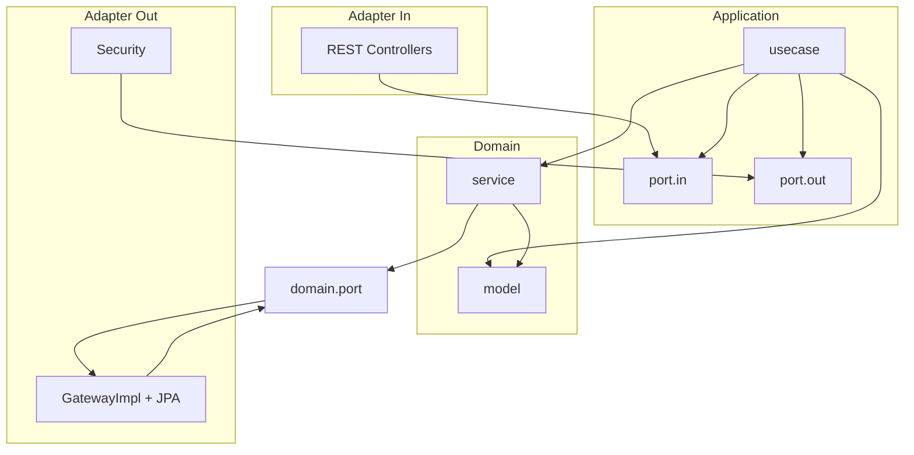

# GAC Backend — Clean Architecture

## Layer overview

Dependency rule: **inner layers never depend on outer layers**.

```
com.gac.api
├── domain/                         # Entities + domain services + domain exceptions
│   ├── model/
│   ├── port/                       # Outbound ports defined by the domain (persistence)
│   ├── service/movement/
│   └── exception/
├── application/                    # Use cases + ports
│   ├── dto/movement/               # Command / Result for critical flows
│   ├── port/in/                    # Primary ports (driving)
│   ├── port/out/                   # App-only outbound (e.g. PasswordHasher)
│   └── usecase/                    # Interactors implementing port/in
└── adapter/
    ├── in/web/                     # REST API (controllers, DTOs, mappers)
    └── out/
        ├── configuration/          # Spring @Bean wiring
        ├── persistence/            # JPA adapters (gateway implementations)
        ├── security/               # JWT, BCrypt, SecurityFilterChain
        └── scheduler/              # Scheduled jobs (UC17)
```



## Responsibilities

| Layer | Responsibility |
|-------|----------------|
| **domain.model** | `User`, `Projector`, `Key`, `Movement`, enums, read models (`AssetSummary`, `MovementReport`) |
| **domain.port** | Persistence contracts (`MovementGateway`, `UserGateway`, …) — implemented in `adapter.out.persistence` |
| **domain.service** | Business rules: `ShiftRules`, `ProfessorPendencyRules`, `AssetInventory`, … |
| **application.dto** | `*Command` / `MovementResult` at use-case boundaries (reserva, empréstimo, devolução, cancelamento) |
| **application.port.in** | API consumed by adapters (e.g. `ConfirmLoanInputPort`) |
| **application.port.out** | Cross-cutting app ports (`PasswordHasher`) |
| **application.usecase** | Orchestration; implements `*InputPort`; uses `domain.port` + domain services |
| **adapter.in.web** | HTTP, validation DTOs, mapping to/from domain |
| **adapter.out.*** | Spring, JPA, JWT, cron |

Wiring: `adapter.out.configuration.*` registers `@Bean` methods that return `*InputPort` and construct concrete `*UseCase` classes.

## Domain model (v1.3 alignment)

### Roles
`ADMIN`, `ATTENDANT`, `PROFESSOR`

### Item status
`AVAILABLE`, `RESERVED`, `ON_LOAN`, `MAINTENANCE`

### Movement types
`RESERVATION`, `LOAN`, `RETURN`, `EXCHANGE`

### Movement lifecycle
Each movement references **one asset** (`assetType` + `assetId`).

| Status | Meaning |
|--------|---------|
| `OPEN` | Active reservation or loan |
| `COMPLETED` | Finished (e.g. reservation converted to loan) |
| `CANCELLED` | Cancelled reservation |

**RN08:** movements are never deleted — only status transitions and new records.

### Asset fields (Projector / Key)
- `reservedRegistrationNumber` — set when status is `RESERVED`
- `defectDescription` — set when returned with defect or exchanged
- Projector: `serialNumber`
- Key: `spareKey`, optional `assetTag`

## Movement flow (reservation → loan)

```
Professor                    System                         Attendant
    |                           |                                |
    |-- CreateReservation ----->|                                |
    |                           | asset → RESERVED               |
    |                           | movement RESERVATION / OPEN    |
    |<-- confirmation code -----|                                |
    |                           |                                |
    |                           |<-------- ConfirmLoan ----------|
    |                           | validate code (RN12)           |
    |                           | RESERVATION → COMPLETED        |
    |                           | LOAN / OPEN                    |
    |                           | asset → ON_LOAN                |
```

### Use cases
| Input port | Actor | Description |
|------------|-------|-------------|
| `CreateReservationInputPort` | Professor | UC11 — reserve available asset, generate 4-digit code |
| `ConfirmLoanInputPort` | Attendant | UC03 — validate code, close reservation, open loan |
| `CancelReservationInputPort` | Professor | UC11 alt — cancel own open reservation |

## HTTP adapter (REST)

```
adapter/in/web/
├── controller/
├── dto/request|response/
├── mapper/
└── exception/      GlobalExceptionHandler, ApiErrorResponse
```

### Security
- Stateless JWT (`Authorization: Bearer <token>`)
- BCrypt via `PasswordHasher` port (`BcryptPasswordHasher` adapter)
- `@PreAuthorize` on protected routes

### API endpoints

#### Auth & profile
| Method | Path | Roles | Description |
|--------|------|-------|-------------|
| POST | `/api/auth/login` | Public | Login |
| GET | `/api/users/me` | Any | Current profile |
| PATCH | `/api/users/me/password` | Any | Change password (UC18) |

#### Users (UC01)
| Method | Path | Roles |
|--------|------|-------|
| POST/GET/PUT/DELETE | `/api/users` | ADMIN |
| GET | `/api/users/{id}` | ADMIN |

#### Professors (UC02)
| Method | Path | Roles |
|--------|------|-------|
| POST/GET | `/api/professors` | ADMIN, ATTENDANT |

#### Projectors & keys (UC08, UC13, UC14)
| Method | Path | Roles |
|--------|------|-------|
| POST/GET/PUT | `/api/projectors`, `/api/keys` | ADMIN, ATTENDANT |
| GET | `/api/projectors/{id}`, `/api/keys/{id}` | ADMIN, ATTENDANT |
| DELETE | `/api/projectors/{id}`, `/api/keys/{id}` | ADMIN only (RN07) |

### Dev seed users
| Registration | Password | Role |
|--------------|----------|------|
| `admin` | `admin123` | ADMIN |
| `atendente` | `atendente123` | ATTENDANT |

Configure JWT in `application.properties`: `gac.jwt.secret`, `gac.jwt.expiration-ms`.

## Local run

```bash
./gradlew bootRun
```

H2 console: http://localhost:8080/h2-console (JDBC URL `jdbc:h2:mem:gac`)

### Example login

```bash
curl -s -X POST http://localhost:8080/api/auth/login \
  -H 'Content-Type: application/json' \
  -d '{"registrationNumber":"admin","password":"admin123"}'
```